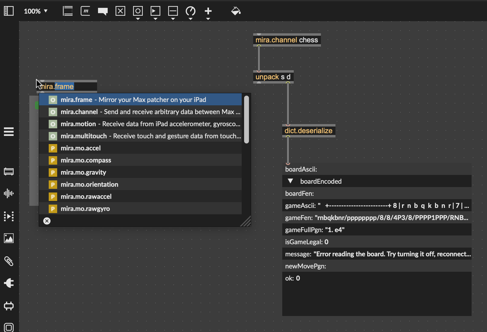

# DGT Chess Board to Max

This app provides communication between a [DGT Chess Board](https://dgtshop.com/) and [Max](https://cycling74.com/). It sends over both the live state of the board, and the state of current chess game in FEN and PGN notation.

♟️♟️♟️ A version of this app is available at [https://dgt2max.netlify.app/](https://dgt2max.netlify.app/). ♟️♟️♟️

You must open it in Google Chrome to be able to connect to the board.

## Playing the game

After following the setup instructions below, do the following:

1. Connect the DGT Board and turn it on
2. Open Max with the required objects (see below)
3. Start the app
4. Press the `Connect to DGT Board` button (select board)
5. Play moves and use the `W` and `B` keys to confirm moves for White and Black respectively.

If an illegal move is made, a message will be displayed on the screen. To resume the game, move the piece(s) back to the last legal position (displayed on screen). At this point you will be able to use the `W` and `B` keys to confirm moves again.

:warning: One edge case here is if a move is submitted, but no pieces were moved, it will still register as an illegal move. To reset, pick up any piece and return it to it's original position.

## Max Setup

In Max you need to create a `mira.frame` object and a `mira.channel` with the name property set to `chess` e.g.`[mira.channel chess]`.

Connect the output of the `mira.channel` to an `unpack` object with two parameters.

Connect the second output of `unpack` to a `dict.deserialize` object, this will give you a Max dictionary every time something changes with on the board. See the section on Board messages below for details.



## DGT App Setup

1. Install Node: [https://nodejs.org/](https://nodejs.org/).
2. (Windows Only): install Git https://gitforwindows.org/
3. Run the commands below in a Terminal:
    - macOS: use `/System/Applications/Utilities/Terminal.app`
    - Windows: use `git-bash.exe`

> Tip: you can usually drag a folder into the terminal window to type the full path to the folder, so if you see a command like `cd folder-name` you can type `cd ` then drag the folder in and press enter.

### Installation

```sh
cd dgt-chess-for-max
npm install
```

### Building an app

```sh
npm run make
```

There will now be an executable (`.app` on macOS, `.exe` on Windows) inside the folder called `out`, e.g. `out/make/zip/darwin/arm64/chess.app`.

### Running the app

```sh
npm start
```

### Running the app in Chrome

```sh
npm run dev
```

This will run the app so it can be opened in Google Chrome. It should open automatically. If Chrome is not your default Web browser, you will need to manually go to [http://localhost:6060/](http://localhost:6060/)

## Board Messages

### Board Messages

Each message contains the following data:

> Note: there is a distinction between the state of the "Game", and the state of the "Board". The "Game" is always valid, it shows the last valid position. The "Board" is the live state of the board, even if invalid.

- `ok` : `boolean (1 or 0)`
    - Whether the message represents a valid message, or an error. 1 = good, 0 = error. You will get errors if there was a problem reading the board, not if an illegal move was made.
- `fullPgn` : `string`
    - The full PGN of the game, all the moves so far.
- `newMovePgn` : `string`
    - The single move –in PGN– if the game changed e.g. `"e5"`.
- `boardEncoded` : `Uint8Array`
    - State of the board, represented as numbers: 64 numbers, see details below
- `boardAscii` : `string`
    - State of the Board as ASCII, for easily visualizing
- `gameAscii` : `string`
    - State of the Game as ASCII
- `gameFen` : `string`
    - FEN for the Game
- `message` : `string`
    - More info, e.g. will describe the error when ok is 0
- `isGameLegal` : `boolean`
    - Whether the board is currently in a legal position or not

#### Board encoded

This is an array of 64 numbers that represent the board. This is the raw data read from the DGT board (minus the three number header they add). The order of the numbers represents the square, the value of the number represents the piece.

```
Squares

"a8", "b8", "c8", "d8", "e8", "f8", "g8", "h8",
"a7", "b7", "c7", "d7", "e7", "f7", "g7", "h7",
"a6", "b6", "c6", "d6", "e6", "f6", "g6", "h6",
"a5", "b5", "c5", "d5", "e5", "f5", "g5", "h5",
"a4", "b4", "c4", "d4", "e4", "f4", "g4", "h4",
"a3", "b3", "c3", "d3", "e3", "f3", "g3", "h3",
"a2", "b2", "c2", "d2", "e2", "f2", "g2", "h2",
"a1", "b1", "c1", "d1", "e1", "f1", "g1", "h1",

Pieces

 0 = Empty
 1 = White Pawn
 2 = White Rook
 3 = White Knight
 4 = White Bishop
 5 = White King
 6 = White Queen
 7 = Black Pawn
 8 = Black Rook
 9 = Black Knight
10 = Black Bishop
11 = Black King
12 = Black Queen


Starting Position

 8,  9, 10, 12, 11, 10,  9,  8,
 7,  7,  7,  7,  7,  7,  7,  7,
 0,  0,  0,  0,  0,  0,  0,  0,
 0,  0,  0,  0,  0,  0,  0,  0,
 0,  0,  0,  0,  0,  0,  0,  0,
 0,  0,  0,  0,  0,  0,  0,  0,
 1,  1,  1,  1,  1,  1,  1,  1,
 2,  3,  4,  6,  5,  4,  3,  2,
```

## Authors

Arthur Carabott

Developed for [Los Feliz Chess Club](https://www.instagram.com/losfelizchessclub/)

## Libraries

- [chess.js](https://github.com/jhlywa/chess.js) (BSD-2)
- Modified version of [DGTChess](https://github.com/fnogatz/dgtchess/) (GPL)
